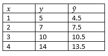

```{r, echo = FALSE, results = "hide"}
include_supplement("vufgb-equation-015-nl-table01.jpg", recursive = TRUE)
```

Question
========

Given are the scores below for the variables *x* and *y*. The estimated regression line is $\hat{y} = 1.5+3x$. Calculate the conditional variance. 


  
Answerlist
----------
* 1
* 0
* 0.50
* 0.71


Solution
========

Answerlist
----------
* Incorrect
* Incorrect
* Correct
* Incorrect

Meta-information
================
exname: vufgb-equation-015-en
extype: schoice
exsolution: 0010
exsection: Inferential Statistics/Regression/Equation
exextra[Type]: Interpreting output, Calculation
exextra[Program]: 
exextra[Language]: English
exextra[Level]: Statistical Thinking
