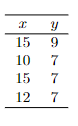

```{r, echo = FALSE, results = "hide"}
include_supplement("vufgb-equation-016-nl-table01.jpg", recursive = TRUE)
```

Question
========

See table below


  
It is known that the averages of x and y are, respectively, 13 and 7.5, $s_{x} = 2.45$ and the estimated regression line is $\hat{y} = 4.61+0.22x$. What is the correlation between x and y?  
  
Answerlist
----------
* 0.22
* 0.54
* -0.22
* -0.54

Solution
========

Answerlist
----------
* Incorrect
* Correct
* Incorrect
* Incorrect

Meta-information
================
exname: vufgb-equation-016-en
extype: schoice
exsolution: 0100
exsection: Inferential Statistics/Regression/Equation, Inferential Statistics/Sampling Distributions/Correlation, Inferential Statistics/Regression
exextra[Type]: Calculation, Interpreting output
exextra[Program]: 
exextra[Language]: English
exextra[Level]: Statistical Thinking
