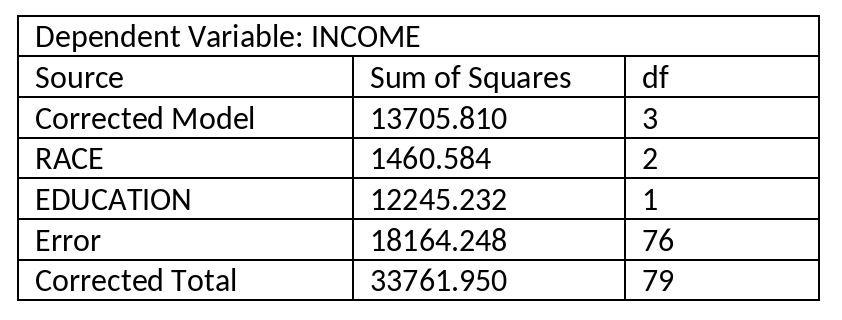

```{r, echo = FALSE, results = "hide"}
include_supplement("vufgb-etasquared-002-en-graph-01.png", recursive = TRUE)
```
Question
========
  
Below you see an incomplete ANOVA table of a two-way ANOVA without interaction. Calculate the partial $\eta ^{2}$ for Race and describe the effect size in words.

 
  
Answerlist
----------
* 0.04. This is a small to medium effect.
* 0.07. This is a medium to large effect.
* 0.07. This is a small to medium effect.
* 0.04. This is a medium to large effect.

Solution
========

Answerlist
----------
* Incorrect
* Correct
* Incorrect
* Incorrect

Meta-information
================
exname: vufgb-etasquared-002-en
extype: schoice
exsolution: 0100
exsection: Inferential Statistics/Effect size/Eta squared
exextra[Type]: Calculation
exextra[Language]: English
exextra[Level]: Statistical Thinking
