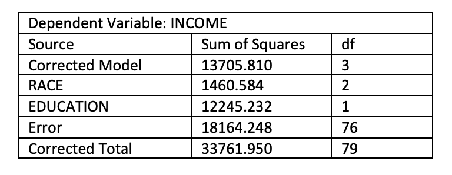

```{r, echo = FALSE, results = "hide"}
include_supplement("vufgb-etasquared-003-nl-graph-01.png", recursive = TRUE)
```
Question
========
  
Hieronder zie je een incomplete ANOVA tabel van een tweewegs variantieanalyse (two-way ANOVA) zonder interactie. Bereken de partiele $\eta ^{2}$ voor Race en beschrijf de effectsterkte in woorden. 

 
  
Answerlist
----------
* 0.04. Dit is een klein tot middelmatig effect.
* 0.07. Dit is een middelmatig tot groot effect.
* 0.07. Dit is een klein tot middelmatig effect.
* 0.04. Dit is een middelmatig tot groot effect.

Solution
========

Answerlist
----------
* Incorrect
* Correct
* Incorrect
* Incorrect

Meta-information
================
exname: vufgb-etasquared-003-nl
extype: schoice
exsolution: 0100
exsection: Inferential Statistics/Effect size/Eta squared
exextra[ID]: 719ee
exextra[Type]: Calculation
exextra[Language]: Dutch
exextra[Level]: Statistical Thinking
