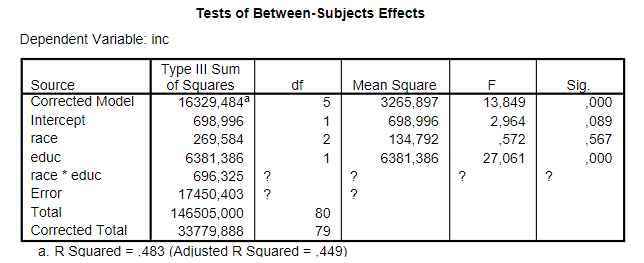

```{r, echo = FALSE, results = "hide"}
include_supplement("vufgb-etasquared-004-nl-table01.jpg", recursive = TRUE)
```

Question
========
  
In een onderzoek worden verschillen in inkomen tussen drie ethnische groepen in de Verenigde Staten onderzocht (N = 80). De onafhankelijke variabele race had drie niveau’s: 1) White, 2) Hispanic en 3) Black. De afhankelijke variabele is het inkomen (inc), en als covariaat wordt het aantal jaren genoten onderwijs (educ) gebruikt. Gegeven is de volgende output van een GLM.



Tips:

• Bij ANCOVA is het aantal vrijheidsgraden voor een covariaat gelijk aan 1.
6 Versie A

• In een ANCOVA met een interactie tussen covariaat en de factor is het aantal vrijheidsgraden voor de
Error gelijk aan n −2 ×g.

• De vrijheidsgraden voor de interactie zijn gelijk aan het product van de vrijheidsgraden van Covariaat en
Factor.

• Voor een echte ANCOVA is het aantal vrijdheidsgraden voor de Error gelijk aan n −g −1.


De partiele $\eta ^{2}$ van de factor race in dit model is:
  
Answerlist
----------
* 0.154 en dat is een middelgroot tot groot effect.
* 0.154 en dat is een klein tot middelgroot effect.
* 0.015 en dat is een middelgroot tot groot effect.
* 0.015 en dat is een klein tot middelgroot effect.

Solution
========

Answerlist
----------
* Correct
* Incorrect
* Incorrect
* Incorrect

Meta-information
================
exname: vufgb-etasquared-004-nl
extype: schoice
exsolution: 1000
exsection: Inferential Statistics/Effect size/Eta squared, Descriptive statistics/Data representation/Tables
exextra[Type]: Calculation, Interpreting output
exextra[Program]: 
exextra[Language]: Dutch
exextra[Level]: Statistical Thinking 
