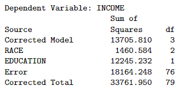

```{r, echo = FALSE, results = "hide"}
include_supplement("vufgb-etasquared-006-nl-table01.jpg", recursive = TRUE)
```

Question
========

Given is the following incomplete ANOVA table:


  
What is the partial $\eta^{2}$ From Education?  
  
Answerlist
----------
* 0.40. This is a large effect.
* 0.04. This is a small to medium effect.
* 0.40. This is a small to moderate effect.
* 0.04. This is a large effect.

Solution
========

Answerlist
----------
* Correct
* Incorrect
* Incorrect
* Incorrect

Meta-information
================
exname: vufgb-etasquared-006-en
extype: schoice
exsolution: 1000
exsection: Inferential Statistics/Effect size/Eta squared
exextra[Type]: Interpreting output, Calculation
exextra[Program]: 
exextra[Language]: English
exextra[Level]: Statistical Thinking
