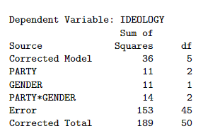

```{r, echo = FALSE, results = "hide"}
include_supplement("vufgb-etasquared-007-nl-table01.jpg", recursive = TRUE)
```

Question
========

Given is the following incomplete ANOVA table:



What is the partial $\eta^{2}$ Of interaction? 
Answerlist
----------
* $\eta^{2}$ is 0.084. This is a medium to large effect.
* $\eta^{2}$ is 0.042. This is a small to moderate effect.
* $\eta^{2}$ is 0.084. This is a small to moderate effect.
* $\eta^{2}$ is 0.042. This is a medium to large effect.

Solution
========

Answerlist
----------
* Correct
* Incorrect
* Incorrect
* Incorrect

Meta-information
================
exname: vufgb-etasquared-007-en
extype: schoice
exsolution: 1000
exsection: Inferential Statistics/Effect size/Eta squared, Inferential Statistics/Parametric Techniques/ANOVA
exextra[ID]: 8657e
exextra[Type]: Interpreting output
exextra[Program]: 
exextra[Language]: English
exextra[Level]: Statistical Literacy
