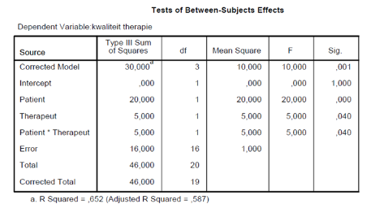

```{r, echo = FALSE, results = "hide"}
include_supplement("vufgb-etasquared-012-nl-table01.jpg", recursive = TRUE)
```

Question
========

Consider the ANOVA table below showing between-subjects effects (*between-subjects effects*) for patients and therapists in explaining differences in therapy quality in hospitals. How large is the partial $\eta^{2}$ for the interaction term in the model?


  
Answerlist
----------
* 0.238
* 0.328
* 0.429
* 0.294

Solution
========

Answerlist
----------
* Correct
* Incorrect
* Incorrect
* Incorrect

Meta-information
================
exname: vufgb-etasquared-012-en
extype: schoice
exsolution: 1000
exsection: Inferential Statistics/Effect size/Eta squared, Inferential Statistics/Parametric Techniques/ANOVA
exextra[Type]: Calculation
exextra[Program]: 
exextra[Language]: English
exextra[Level]: Statistical Literacy
