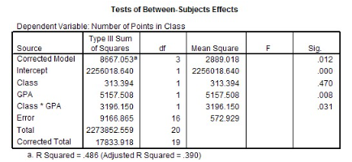

```{r, echo = FALSE, results = "hide"}
include_supplement("vufgb-etasquared-013-nl-table01.jpg", recursive = TRUE)
```

Question
========

For the SPSS output given below, calculate the *partial eta squared* ($partial$ $\eta^{2}$) for "GPA." 


  
Answerlist
----------
* 0.353
* 0.360
* 0.033
* 0.0001

Solution
========

Answerlist
----------
* Incorrect
* Correct
* Incorrect
* Incorrect

Meta-information
================
exname: vufgb-etasquared-013-en
extype: schoice
exsolution: 0100
exsection: Inferential Statistics/Effect size/Eta squared
exextra[ID]: d0ca5
exextra[Type]: Calculation, Interpreting output
exextra[Program]: SPSS
exextra[Language]: English
exextra[Level]: Statistical Literacy
