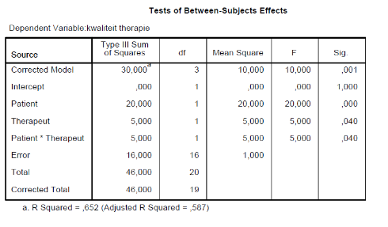

```{r, echo = FALSE, results = "hide"}
include_supplement("vufgb-etasquared-014-nl-table01.jpg", recursive = TRUE)
```

Question
========

Consider the below ANOVA table of between-subjects effects (*between-subjects effects*) for patients and therapists in explaining differences in therapy quality in hospitals.

How large is the $\eta^{2}$ of the interaction term in the model?



  
Answerlist
----------
* 0.238
* 0.109
* 0.313
* 0.652

Solution
========

Answerlist
----------
* Incorrect
* Correct
* Incorrect
* Incorrect

Meta-information
================
exname: vufgb-etasquared-014-en
extype: schoice
exsolution: 0100
exsection: Inferential Statistics/Effect size/Eta squared, Inferential Statistics/Parametric Techniques/ANOVA
exextra[Type]: Interpreting output, Calculation
exextra[Program]: SPSS
exextra[Language]: English
exextra[Level]: Statistical Literacy
