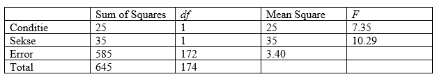

```{r, echo = FALSE, results = "hide"}
include_supplement("vufgb-etasquared-017-nl-table01.jpg", recursive = TRUE)
```

Question
========

Given below is the incomplete ANOVA table of a two-way analysis of variance (two-way ANOVA) with no interaction.

Calculate the partial $\eta^{2}$ For Condition.


  
Answerlist
----------
* 0.039
* 0.041
* 0.043
* 0.197

Solution
========

$\eta^{2} = \frac{SS_{effect}}{(SS_{effect}+SS_{error})} = \frac{25}{(25+585)} = 0.041$.

Answerlist
----------
* Incorrect
* Correct
* Incorrect
* Incorrect

Meta-information
================
exname: vufgb-etasquared-017-en
extype: schoice
exsolution: 0100
exsection: Inferential Statistics/Effect size/Eta squared, Inferential Statistics/Parametric Techniques/ANOVA/Twoway ANOVA
exextra[Type]: Calculation
exextra[Program]: 
exextra[Language]: English
exextra[Level]: Statistical Thinking
