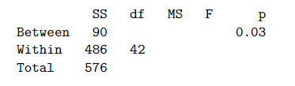

```{r, echo = FALSE, results = "hide"}
include_supplement("vufgb-fstatistic-002-nl-table01.jpg", recursive = TRUE)
```

Question
========

An A&O psychologist compares levels of extraversion among Administrative, Managerial and Sales personnel. A total of 45 people are participating. Below is the incomplete table with data resulting from an Oneway Anova with Personnel as the Factor and Extraversion as the dependent variable.



How large is the F-statistic?

Answerlist
----------
* 0.14
* 81.00
* 3.89
* 6.71

Solution
========

Answerlist
----------
* Incorrect
* Incorrect
* Correct
* Incorrect

Meta-information
================
exname: vufgb-fstatistic-002-en
extype: schoice
exsolution: 0010
exsection: Inferential Statistics/NHST/Test statistic/F-statistic, Inferential Statistics/Parametric Techniques/ANOVA/Oneway ANOVA
exextra[ID]: ea4a7
exextra[Type]: Interpreting output, Calculation
exextra[Program]: 
exextra[Language]: English
exextra[Level]: Statistical Thinking
