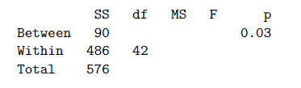

```{r, echo = FALSE, results = "hide"}
include_supplement("vufgb-fstatistic-002-nl-table01.jpg", recursive = TRUE)
```

Question
========

Een A&O-psycholoog vergelijkt de mate van extraversie onder Administratief, Leidinggevend en Verkopend personeel. In totaal doen 45 personen mee. Hieronder staat de incomplete tabel met gegevens die het resultaat zijn van een Oneway Anova met Personeel als Factor en extraversie als afhankelijke variabele.



Hoe groot is de F-statistic?

Answerlist
----------
* 0.14
* 81.00
* 3.89
* 6.71

Solution
========

Answerlist
----------
* Incorrrect
* Incorrect
* Correct
* Incorrect

Meta-information
================
exname: vufgb-fstatistic-002-nl
extype: schoice
exsolution: 0010
exsection: Inferential Statistics/NHST/Test statistic/F-statistic, Inferential Statistics/Parametric Techniques/ANOVA/Oneway ANOVA
exextra[Type]: Interpreting output, Calculation
exextra[Program]: 
exextra[Language]: Dutch
exextra[Level]: Statistical Thinking
