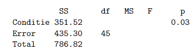

```{r, echo = FALSE, results = "hide"}
include_supplement("vufgb-fstatistic-003-nl-table01.jpg", recursive = TRUE)
```

Question
========

In a study of memorization of verbal material as a function of level of information processing, five experimental conditions were: Counting, Rhyming, Adjective, Imagery and Intentional, with 10 observations each (N = 50). To test differences in the average number of memorized words, ANOVA was performed resulting in the partial results below:


  
How large is the F-statistic?  
  
Answerlist
----------
* 3.92
* 4.12
* 9.08
* 8.79

Solution
========

Answerlist
----------
* Incorrect
* Incorrect
* Correct
* Incorrect

Meta-information
================
exname: vufgb-fstatistic-003-en
extype: schoice
exsolution: 0010
exsection: Inferential Statistics/NHST/Test statistic/F-statistic, Inferential Statistics/Parametric Techniques/ANOVA
exextra[ID]: 694d8
exextra[Type]: Interpreting output, Calculation, Case
exextra[Program]: 
exextra[Language]: English
exextra[Level]: Statistical Thinking
