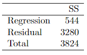

```{r, echo = FALSE, results = "hide"}
include_supplement("vufgb-fstatistic-004-nl-table01.jpg", recursive = TRUE)
```

Question
========

See data below. These sum of squares (English: Sum of Squares (SS)) are based on a single regression of dementia scores on age. The sample consists of 50 individuals.


  
Calculate the value of $r^{2}$.  
  
Answerlist
----------
* 0.14
* 0.17
* 0.83
* 0.86

Solution
========

Answerlist
----------
* Correct
* Incorrect
* Incorrect
* Incorrect

Meta-information
================
exname: vufgb-fstatistic-004-en
extype: schoice
exsolution: 1000
exsection: Inferential Statistics/NHST/Test statistic/F-statistic, Inferential Statistics/Regression/Sum of squares, Inferential Statistics/Regression/R squared
exextra[ID]: acacb
exextra[Type]: Calculation, Interpreting output
exextra[Program]: 
exextra[Language]: English
exextra[Level]: Statistical Thinking
