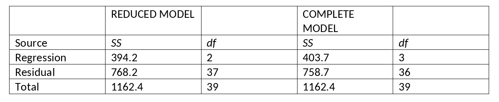

```{r, echo = FALSE, results = "hide"}
include_supplement("vufgb-ftestforcomparingnestedmodels-002-nl-graph-01.png", recursive = TRUE)
```
Question
========
  
Gegeven is de volgende SPSS-output van twee meervoudige regressie modellen. Bereken de *F*-ratio van de test die de twee modellen vergelijkt (‘Model Comparison Test’).


  
Answerlist
----------
* 0.07
* 0.45
* 6.38
* 9.501

Solution
========

Answerlist
----------
* Incorrect
* Correct
* Incorrect
* Incorrect

Meta-information
================
exname: vufgb-ftestforcomparingnestedmodels-002-nl
extype: schoice
exsolution: 0100
exsection: Inferential Statistics/Regression/Multiple linear regression/F-test for comparing (nested) models
exextra[Type]: Calculation, Interpreting output
exextra[Language]: Dutch
exextra[Level]: Statistical Thinking