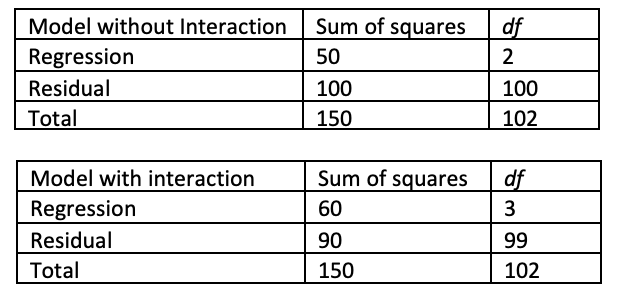

```{r, echo = FALSE, results = "hide"}
include_supplement("vufgb-ftestforcomparingnestedmodels-003-en-graph-01.png", recursive = TRUE)
```
Question
========
  
Below the ANOVA tables for two regression models are provided, one model without and one with interaction term. Conduct a Model Comparison Test and report the test statistics.

 
  
Answerlist
----------
* *F* (1,100) = 10 ; p < .05.
* *F* (3,99) = 22 ; p < .05.
* *F* (1,99) = 11 ; p < .05.
* *F* (99,100) = 1.1 ; p < .05.

Solution
========

Answerlist
----------
* Incorrect
* Incorrect
* Correct
* Incorrect

Meta-information
================
exname: vufgb-ftestforcomparingnestedmodels-003-en
extype: schoice
exsolution: 0010
exsection: Inferential Statistics/Regression/Multiple linear regression/F-test for comparing (nested) models
exextra[Type]: Calculation
exextra[Language]: English
exextra[Level]: Statistical Thinking