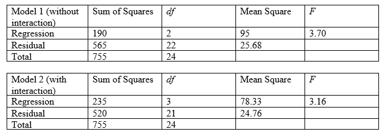

```{r, echo = FALSE, results = "hide"}
include_supplement("vufgb-ftestforcomparingnestedmodels-004-en-table01.jpg", recursive = TRUE)
```

Question
========

Given are the ANOVA tables of two regression models: one model with two predictors, and one model with two predictors and their interaction. 

Use the Model Comparison Test to determine whether there is a significant interaction.


  
Answerlist
----------
* $F(df_{1}=3, \; df_{2}=21)= 3.16 > 3.07$, so significant interaction
* $F(df_{1}=1, \; df_{2}=3)= 0.57 <10.13$, so no significant interaction
* $F(df_{1}=1, \; df_{2}=21)= 1.82 < 4.32$, so no significant interaction
* $F(df_{1}=1, \; df_{2}=1)= 0.54 < 161.4$, so no significant interaction

Solution
========

$F= \frac{[(SSE_{r}-SSE_{c})/df_{1}]}{[SSE_{c}/df_{2}]} =\frac{[(565-520)/1]}{[520/21]} = \frac{45}{24.76}=1.82$. With $df_{1} = 1$ (difference in df’s between complete and reduced model) and $df_{2} = 21$ (df of SSE in complete model). Look in the *F*-table at $df_{1} = 1$ and $df_{2}=21$ what the critical F-value is, this is 4.32. Founded F < critical F, so adding the interaction-term in model 2 does not lead to significant less error, so there is no significant interaction.

Answerlist
----------
* Incorrect
* Incorrect
* Correct
* Incorrect

Meta-information
================
exname: vufgb-ftestforcomparingnestedmodels-004-en
extype: schoice
exsolution: 0010
exsection: Inferential Statistics/Regression/Multiple linear regression/F-test for comparing (nested) models, Inferential Statistics/Parametric Techniques/ANOVA
exextra[Type]: Performing analysis, Calculation, Interpreting output
exextra[Program]: 
exextra[Language]: English
exextra[Level]: Statistical Thinking
