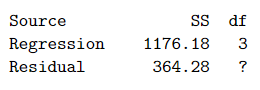

```{r, echo = FALSE, results = "hide"}
include_supplement("vufgb-ftestforcomparingnestedmodels-004-nl-table01.jpg", recursive = TRUE)
```

Question
========

In een onderzoek wordt een regressievergelijking met 3 predictoren geschat op de data van 20 waarnemingen en is de volgende ANOVA-tabel het resultaat:


  
Wat is de F-ratio van dit model?  
  
Answerlist
----------
* 23.27
* 25.83
* 17.22
* 20.44

Solution
========

Answerlist
----------
* Incorrect
* Incorrect
* Correct
* Incorrect

Meta-information
================
exname: vufgb-ftestforcomparingnestedmodels-004-nl
extype: schoice
exsolution: 0010
exsection: Inferential Statistics/Regression/Multiple linear regression/F-test for comparing (nested) models, Descriptive statistics/Data representation/Tables
exextra[ID]: 064be
exextra[Type]: Interpreting output, Calculation
exextra[Program]: 
exextra[Language]: Dutch
exextra[Level]: Statistical Literacy
