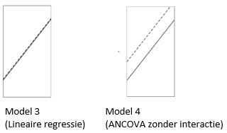

```{r, echo = FALSE, results = "hide"}
include_supplement("vufgb-ftestforcomparingnestedmodels-007-nl-figure01.jpg", recursive = TRUE)
```

Question
========

An F-test is used to compare two models. Both models are shown in the figure below. What is the null hypothesis associated with this F-test?


  
Answerlist
----------
* No effect of factor A.
* Some effect of factor A.
* No effect of covariate.
* Well an effect of the covariate.

Solution
========

Answerlist
----------
* Correct
* Incorrect
* Incorrect
* Incorrect

Meta-information
================
exname: vufgb-ftestforcomparingnestedmodels-007-en
extype: schoice
exsolution: 1000
exsection: Inferential Statistics/Regression/Multiple linear regression/F-test for comparing (nested) models
exextra[Type]: Interpreting graph
exextra[Program]: 
exextra[Language]: English
exextra[Level]: Statistical Literacy
