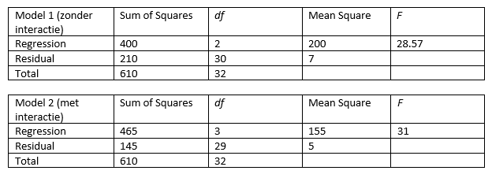

```{r, echo = FALSE, results = "hide"}
include_supplement("vufgb-ftestforcomparingnestedmodels-008-nl-table01.jpg", recursive = TRUE)
```

Question
========

Given are the ANOVA tables of two nested regression models: one model with two predictors, and one model with two predictors and their interaction. Use the model comparison test ("Model Comparison Test") to determine whether there is significant interaction.


  
Answerlist
----------
* *F*(df1=3, df2=30)= 4.48 > 2.92, so significant interaction
* *F*(df1=3, df2=29)= 4.33 > 2.93, so significant interaction
* *F*(df1=1, df2=30)= 13.45 > 4.17, so significant interaction
* *F*(df1=1, df2=29)= 13.00 > 4.18, so significant interaction


Solution
========

Answerlist
----------
* Incorrect
* Incorrect
* Incorrect
* Correct

Meta-information
================
exname: vufgb-ftestforcomparingnestedmodels-008-en
extype: schoice
exsolution: 0001
exsection: Inferential Statistics/Regression/Multiple linear regression/F-test for comparing (nested) models
exextra[Type]: Performing analysis, Interpreting output, Calculation
exextra[Program]: 
exextra[Language]: English
exextra[Level]: Statistical Thinking
