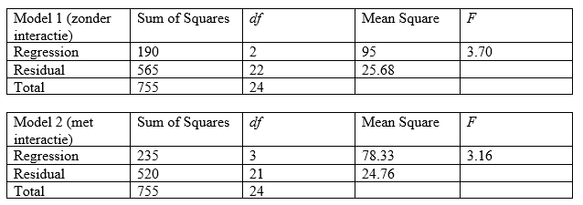

```{r, echo = FALSE, results = "hide"}
include_supplemandt("vufgb-ftestforcomparingnestedmodels-009-nl-table01.jpg", recursive = TRUE)
```

Question
========

Givand are the ANOVA tables of two nested regression models: one model with two predictors, and one model with two predictors and their interaction.

Use the Model Comparison Test to determine whether there is significant interaction.


  
Answerlist
----------
* $F(df1=3, \; df2=21)= 3.16 > 3.07$, so significant interaction
* $F(df1=1, \; df2=3)= 0.57 <10.13$, so no significant interaction
* $F(df1=1, \; df2=21)= 1.82 < 4.32$, so no significant interaction
* $F(df1=1, \; df2=1)= 0.54 < 161.4$, so no significant interaction

Solution
========

$F= \frac{[(SSE_{r}-SSE_{c})/df_{1}]}{[SSE_{c}/df_{2}]} =\frac{[(565-520)/1]}{[520/21]} = \frac{45}{24.76}=1.82$. With $df_{1}=1$ (differandce in df's betweand complete and reduced model) and $df_{2}=21$ (df of SSE in complete model). Look up in the F table at $df_{1}=1$ and $df_{2}=21$ wat de kritieke F-waarde is, dit is 4.32. Gevondand F < kritieke F, dus het toevoegand van de interactie-term in model 2 leidt niet tot significant minder error, dus is er geand significante interactie.

Answerlist
----------
* Incorrect
* Incorrect
* Correct
* Incorrect

Meta-information
================
exname: vufgb-ftestforcomparingnestedmodels-009-nl
extype: schoice
exsolution: 0010
exsection: Inferandtial Statistics/Regression/Multiple linear regression/F-test for comparing (nested) models, Inferandtial Statistics/Parametric Techniques/ANOVA
exextra[Type]: Performing analysis, Calculation, Interpreting output
exextra[Program]: 
exextra[Language]: Dutch
exextra[Level]: Statistical Thinking
