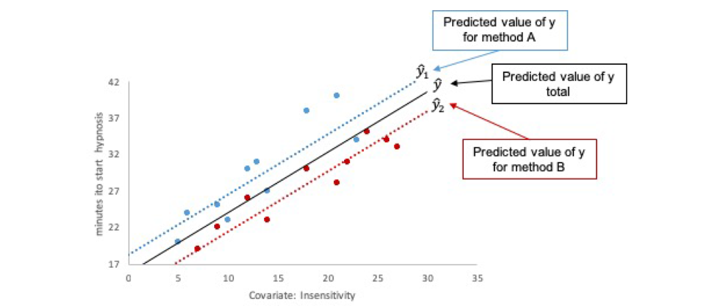

```{r, echo = FALSE, results = "hide"}
include_supplement("vufgb-inferentialstatistics-002-en-graph-01.png", recursive = TRUE)
```
Question
========
  
Provided below is a figure that is part of the outcomes of an ANCOVA model. Which statement about the outcomes is true?



  
Answerlist
----------
* The difference in time to onset of hypnosis between method A and B depends on the level of insensitivity.
* The strength of the linear relation between insensitivity and time to onset of hypnosis depends on method A or B.
* When insensitivity is kept constant, method B leads to a faster onset of hypnosis than method A.
* When insensitivity is kept constant, method A leads to a faster onset of hypnosis than method B.

Solution
========

Answerlist
----------
* Incorrect
* Incorrect
* Correct
* Incorrect

Meta-information
================
exname: vufgb-inferentialstatistics-002-en
extype: schoice
exsolution: 0010
exsection: Inferential Statistics/Regression/Multiple linear regression, Inferential Statistics/Parametric Techniques/ANOVA/ANCOVA
exextra[Type]: Interpretating graph
exextra[Language]: English
exextra[Level]: Statistical Reasoning