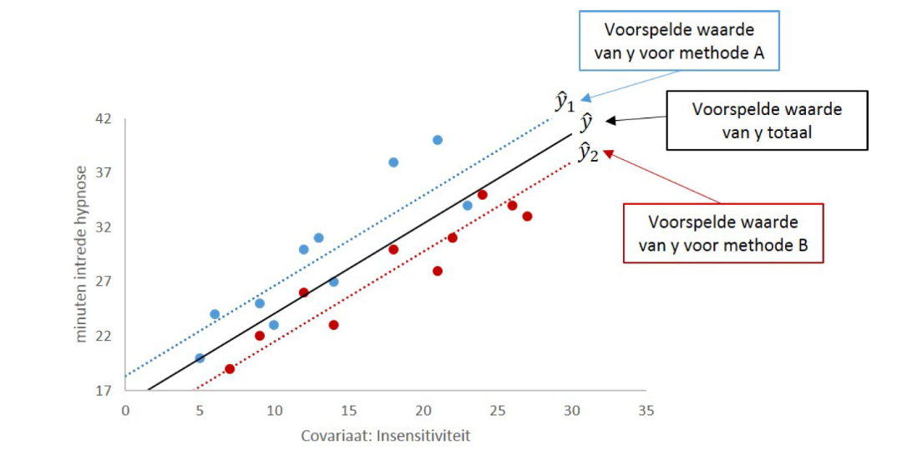

```{r, echo = FALSE, results = "hide"}
include_supplement("vufgb-inferentialstatistics-005-nl-graph-01.png", recursive = TRUE)
```
Question
========
  
Gegeven is onderstaande figuur die hoort bij de uitkomsten van een ANCOVA model. Welke uitspraak over de uitkomsten is waar?



  
Answerlist
----------
* Het verschil in snelheid van intrede van hypnose tussen methode A en B hangt af van de mate van insensitiviteit.
* De sterkte van het lineaire verband tussen insensitiviteit en snelheid van intrede van hypnose hangt af van methode A of B.
* Als insensitiviteit constant wordt gehouden, leidt methode B tot een snellere intrede van hypnose dan methode A.
* Als insensitiviteit constant wordt gehouden, leidt methode A tot een snellere intrede van hypnose dan methode B.

Solution
========

Answerlist
----------
* Incorrect
* Incorrect
* Correct
* Incorrect

Meta-information
================
exname: vufgb-inferentialstatistics-005-nl
extype: schoice
exsolution: 0010
exsection: Inferential Statistics/Regression/Multiple linear regression, Inferential Statistics/Parametric Techniques/ANOVA/ANCOVA
exextra[Type]: Interpreting graph
exextra[Language]: Dutch
exextra[Level]: Statistical Reasoning
