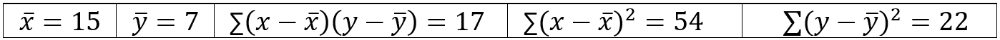

```{r, echo = FALSE, results = "hide"}
include_supplement("vufgb-intercept-001-nl.png", recursive = TRUE)
```

Question
========
Met behulp van onderstaande gegevens, bereken de constante (of: *intercept*) *a* van de geschatte regressielijn die het lineaire verband tussen x en y beschrijft.



Answerlist
----------
* 2.20
* 12.28
* 4.72
* 12.80

Meta-information
================
exname: vufgb-intercept-001-nl
extype: schoice
exsolution: 0100
exsection: Inferential Statistics/Regression/Intercept, Inferential Statistics/Regression/Equation, Inferential Statistics/Regression/Simple linear regression
exextra[ID]: f4e72
exextra[Type]: Calculation
exextra[Language]: Dutch
exextra[Level]: Statistical Thinking
