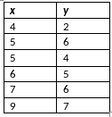

```{r, echo = FALSE, results = "hide"}
include_supplement("vufgb-intercept-004-nl-table01.jpg", recursive = TRUE)
```

Question
========

The table below shows the scores on a *x* and *y* variable for six individuals. The regression coefficient *b* representing the linear relationship between *x* and *y* is 0.81.

Calculate intercept *a*.


  
Answerlist
----------
* 0.14
* 1.95
* -1.24
* 1.19

Solution
========

Answerlist
----------
* Correct
* Incorrect
* Incorrect
* Incorrect

Meta-information
================
exname: vufgb-intercept-004-en
extype: schoice
exsolution: 1000
exsection: Inferential Statistics/Regression/Intercept, Inferential Statistics/Regression
exextra[ID]: f1a43
exextra[Type]: Interpreting output, Calculation
exextra[Program]: 
exextra[Language]: English
exextra[Level]: Statistical Literacy
