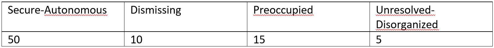

```{r, echo = FALSE, results = "hide"}
include_supplement("vufgb-logisticregression-004-nl.png", recursive = TRUE)
```

Question
========
Given is the frequency table below for the nominal variable Attachment Representation.



The sample contains 80 adults. Calculate the baseline logit of the probability of an outcome "Preoccupied" if "Secure-Autonomous" is the reference category.

Answerlist
----------
* -1.20.
* -0.06.
* 1.10.
* 2.71.

Meta-information
================
exname: vufgb-logisticregression-004-EN
extype: schoice
exsolution: 1000
exsection: Inferential Statistics/Regression/Logistic regression
exextra[ID]: 05635
exextra[Type]: Calculation, Interpreting output
exextra[Language]: Dutch
exextra[Level]: Statistical Thinking
