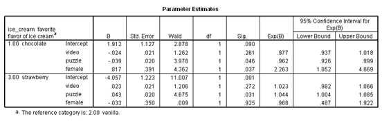

```{r, echo = FALSE, results = "hide"}
include_supplement("vufgb-logisticregression-005-nl.png", recursive = TRUE)
```

Question
========
Given is the table below with results of a multinomial logistic regression analysis. 



The predictor "Female" is dummy-coded (0 = male, 1 = female). Which statement about women and ice cream is TRUE, looking at the result *Exp*(*B*) = 2.263?

Answerlist
----------
* The ratio of women to men who prefer chocolate ice cream is more than two.
* The odds ratio of women liking chocolate ice cream is more than twice that for men.
* The odds ratio of liking chocolate ice cream over vanilla ice cream is over two for women versus men.
* The odds ratio between men and women is more than twice as high for chocolate ice cream versus strawberry ice cream.

Meta-information
================
exname: vufgb-logisticregression-005-EN
extype: schoice
exsolution: 0010
exsection: Inferential Statistics/Regression/Logistic regression
exextra[ID]: 2d2a2
exextra[Type]: Case, Interpreting output
exextra[Language]: Dutch
exextra[Level]: Statistical Thinking
