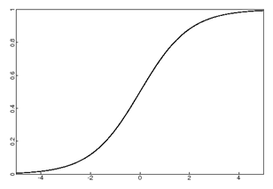

```{r, echo = FALSE, results = "hide"}
include_supplement("vufgb-logisticregression-008-nl.png", recursive = TRUE)
```

Question
========
Given is the following logistic curve. It belongs to a logistic regression analysis. 



What is on the Y-axis?

Answerlist
----------
* The odds of the probability of Y = 1.
* The odds of the probability of Y = 1.
* The logit of the probability of Y = 1.
* The dichotomous Y variable.

Meta-information
================
exname: vufgb-logisticregression-008-en
extype: schoice
exsolution: 1000
exsection: Inferential Statistics/Regression/Logistic regression
exextra[Type]: Interpreting graph
exextra[Language]: English
exextra[Level]: Statistical Thinking
