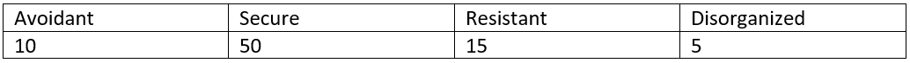

```{r, echo = FALSE, results = "hide"}
include_supplement("vufgb-logisticregression-009-nl.png", recursive = TRUE)
```

Question
========
Given is the frequency table below. It refers to the nominal variable "Attachment Relationship." The sample consisted of 80 children. 



Calculate the *baseline logit* of the probability of an outcome "Avoidant," when "Secure" is the reference category.

Answerlist
----------
* -2.08
* -1.61
* 2.08
* 1.61

Meta-information
================
exname: vufgb-logisticregression-009-en
extype: schoice
exsolution: 0100
exsection: Inferential Statistics/Regression/Logistic regression
exextra[Type]: Calculation, Case, Interpreting output
exextra[Language]: Dutch
exextra[Level]: Statistical Thinking
