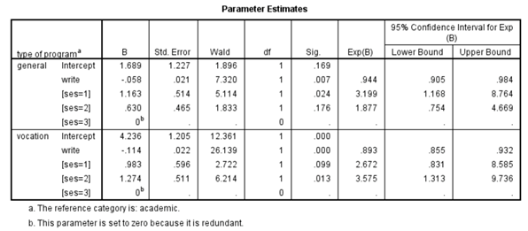

```{r, echo = FALSE, results = "hide"}
include_supplement("vufgb-logisticregression-010-nl.png", recursive = TRUE)
```

Question
========
Given is the output table below from SPSS. 



The results of which model are reported here?

Answerlist
----------
* Log-linear model.
* Binary logistic regression model.
* Ordinal logistic regression model.
* Multinomial logistic regression model.

Meta-information
================
exname: vufgb-logisticregression-010-en
extype: schoice
exsolution: 0001
exsection: Inferential Statistics/Regression/Logistic regression
exextra[ID]: cc39c
exextra[Type]: Conceptual, Interpreting output
exextra[Language]: English
exextra[Level]: Statistical Thinking
