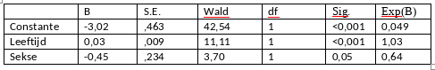

```{r, echo = FALSE, results = "hide"}
include_supplement("vufgb-logisticregression-011-nl-table01.jpg", recursive = TRUE)
```

Question
========

A logistic regression analysis predicts ADHD diagnosis using the variables age and sex (0=boy, 1=girl). The table below shows the output. What is the probability that a 12-year-old boy has ADHD?



  
Answerlist
----------
* 0.03
* 0.04
* 0.07
* 0.36


Solution
========

Answerlist
----------
* Incorrect
* Incorrect
* Correct
* Incorrect

Meta-information
================
exname: vufgb-logisticregression-011-en
extype: schoice
exsolution: 0010
exsection: Inferential Statistics/Regression/Logistic regression, Descriptive statistics/Data representation/Tables
exextra[Type]: Calculation
exextra[Program]: 
exextra[Language]: English
exextra[Level]: Statistical Literacy
