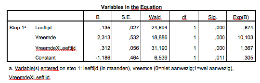

```{r, echo = FALSE, results = "hide"}
include_supplement("vufgb-logisticregression-031-nl-table01.jpg", recursive = TRUE)
```

Question
========

Binary logistic regression analysis is used to examine how infant age and the presence of a stranger are related to the likelihood of crying. SPSS gives the following results. Which conclusion is correct?

Complete.

The probability of crying is ... in the presence of a stranger than in the absence of a stranger. This difference becomes ... as babies get older.


  
Answerlist
----------
* Larger ; larger
* Smaller ; smaller
* Smaller ; larger
* Larger ; smaller

Solution
========

Answerlist
----------
* Correct
* Incorrect
* Incorrect
* Incorrect

Meta-information
================
exname: vufgb-logisticregression-031-en
extype: schoice
exsolution: 1000
exsection: Inferential Statistics/Regression/Logistic regression
exextra[ID]: 7d278
exextra[Type]: Interpreting output
exextra[Program]: SPSS
exextra[Language]: English
exextra[Level]: Statistical Literacy
