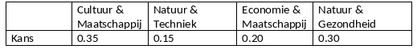

```{r, echo = FALSE, results = "hide"}
include_supplement("vufgb-logisticregression-032-nl-table01.jpg", recursive = TRUE)
```

Question
========

The nominal variable Profile Choice has the following relative frequency distribution in a sample of high school students.

Calculate the baseline-category logit for Economics & Society if Culture & Society is the reference category.


  
Answerlist
----------
* -0.56
* 0.56
* -1.61
* 1.61

Solution
========

Answerlist
----------
* Correct
* Incorrect
* Incorrect
* Incorrect

Meta-information
================
exname: vufgb-logisticregression-032-en
extype: schoice
exsolution: 1000
exsection: Inferential Statistics/Regression/Logistic regression
exextra[ID]: 883f9
exextra[Type]: Calculation, Interpreting output
exextra[Program]: 
exextra[Language]: English
exextra[Level]: Statistical Literacy
