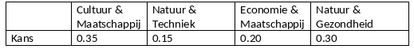

```{r, echo = FALSE, results = "hide"}
include_supplement("vufgb-logisticregression-032-nl-table01.jpg", recursive = TRUE)
```

Question
========

De nominale variabele Profielkeuze heeft de volgende relatieve frequentieverdeling in een steekproef van middelbare scholieren.

Bereken de ‘baseline-category logit’ voor Economie & Maatschappij als Cultuur & Maatschappij de referentiecategorie is.


  
Answerlist
----------
* -0.56
* 0.56
* -1.61
* 1.61

Solution
========

Answerlist
----------
* Correct
* Incorrect
* Incorrect
* Incorrect

Meta-information
================
exname: vufgb-logisticregression-032-nl
extype: schoice
exsolution: 1000
exsection: Inferential Statistics/Regression/Logistic regression
exextra[ID]: f848a
exextra[Type]: Calculation, Interpreting output
exextra[Program]: 
exextra[Language]: Dutch
exextra[Level]: Statistical Literacy
