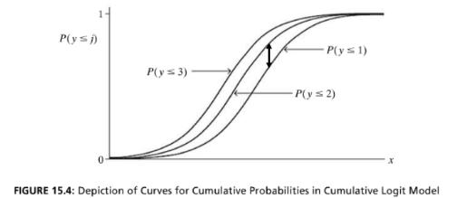

```{r, echo = FALSE, results = "hide"}
include_supplement("vufgb-logisticregression-036-nl-figure01.jpg", recursive = TRUE)
```

Question
========

The figure below shows the relationship between a quantitative *x* and the cumulative probability of an outcome *j* or smaller for an ordinal *y*.

Complete.

The probability of a higher outcome on *y* increases ... as *x* increases, and *y* consists of ... categories.


  
Answerlist
----------
* Af ; 4
* Off ; 3
* Add ; 4
* Add ; 3

Solution
========

Answerlist
----------
* Correct
* Incorrect
* Incorrect
* Incorrect

Meta-information
================
exname: vufgb-logisticregression-036-en
extype: schoice
exsolution: 1000
exsection: Inferential Statistics/Regression/Logistic regression
exextra[ID]: d63b4
exextra[Type]: Interpreting graph
exextra[Program]: 
exextra[Language]: English
exextra[Level]: Statistical Literacy
