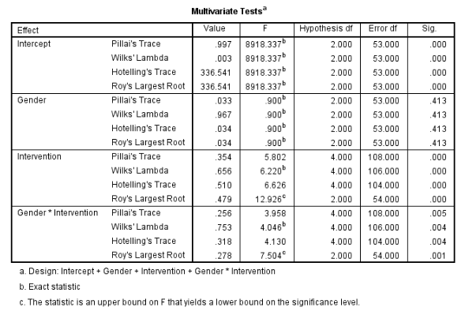

```{r, echo = FALSE, results = "hide"}
include_supplement("vufgb-manova-001-nl-table01.jpg", recursive = TRUE)
```

Question
========

Een onderzoeker wil weten wat het effect is van een nieuwe interventie (*Intervention*) op depressie ($Y_{1}$) en stress ($Y_{2}$) en of er verschillen zijn qua geslacht (*Gender*). Wat is een juiste interpretatie van onderstaande factoriële MANOVA-output?



  
Answerlist
----------
* Er is geen statistisch significant verschil in uitkomsten tussen de controle- en interventiegroep. 
* De verschillen in uitkomsten tussen controle- en interventiegroep hangen samen met geslacht.
* Het statistisch significante interactie-effect tussen geslacht en interventie houdt in dat er voor beide geslachten verschillen zijn tussen de controle- en interventiegroep. 
* Het statistisch significante interactie-effect geeft aan dat één van de assumpties van MANOVA geschonden wordt.

Solution
========

Answerlist
----------
* Incorrect
* Correct
* Incorrect
* Incorrect

Meta-information
================
exname: vufgb-manova-001-nl
extype: schoice
exsolution: 0100
exsection: Inferential Statistics/Parametric Techniques/ANOVA/MANOVA
exextra[ID]: 8ee45
exextra[Type]: Interpreting output, Conceptual
exextra[Program]: SPSS
exextra[Language]: Dutch
exextra[Level]: Statistical Literacy
