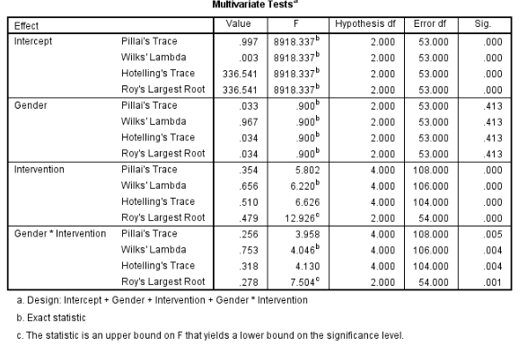

```{r, echo = FALSE, results = "hide"}
include_supplement("vufgb-manova-002-nl-table01.jpg", recursive = TRUE)
```

Question
========

Research was conducted at a high school to investigate possible differences between students working with 3 different teaching methods (*Intervention*) on English outcomes ($Y_{1}$) and mathematics ($Y_{2}$). In addition, it examines whether there are differences between boys and girls (*Gender*). Below is the result of the corresponding MANOVA analysis.

What is a correct interpretation of this output?  


  
Answerlist
----------
* There is no statistically significant difference in outcomes between the 3 teaching methods.
* The differences in outcomes between teaching methods are related to gender.
* The statistically significant interaction effect between gender and intervention implies that there are differences between teaching methods for both genders.
* The statistically significant interaction effect indicates that one of the assumptions of MANOVA is violated.

Solution
========

Answerlist
----------
* Incorrect
* Correct
* Incorrect
* Incorrect

Meta-information
================
exname: vufgb-manova-002-en
extype: schoice
exsolution: 0100
exsection: Inferential Statistics/Parametric Techniques/ANOVA/MANOVA
exextra[ID]: ba59e
exextra[Type]: Interpreting output
exextra[Program]: SPSS
exextra[Language]: English
exextra[Level]: Statistical Literacy
