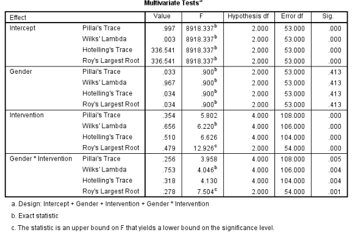

```{r, echo = FALSE, results = "hide"}
include_supplement("vufgb-manova-002-nl-table01.jpg", recursive = TRUE)
```

Question
========

Er is op een middelbare school onderzoek verricht naar mogelijke verschillen tussen leerlingen werkend met 3 verschillende lesmethoden (*Intervention*) op de uitkomsten Engels ($Y_{1}$) en wiskunde ($Y_{2}$). Daarnaast wordt gekeken of er verschillen zijn tussen jongens en meisjes (*Gender*). Hieronder is  het resultaat weergegeven van de bijbehorende MANOVA-analyse. 

Wat is een juiste interpretatie van deze output?  


  
Answerlist
----------
* Er is geen statistisch significant verschil in uitkomsten tussen de 3 lesmethoden. 
* De verschillen in uitkomsten tussen lesmethoden hangen samen met geslacht.
* Het statistisch significante interactie-effect tussen geslacht en interventie houdt in dat er voor beide geslachten verschillen zijn tussen lesmethoden. 
* Het statistisch significante interactie-effect geeft aan dat één van de assumpties van MANOVA geschonden wordt.

Solution
========

Answerlist
----------
* Incorrect
* Correct
* Incorrect
* Incorrect

Meta-information
================
exname: vufgb-manova-002-nl
extype: schoice
exsolution: 0100
exsection: Inferential Statistics/Parametric Techniques/ANOVA/MANOVA
exextra[Type]: Interpreting output
exextra[Program]: SPSS
exextra[Language]: Dutch
exextra[Level]: Statistical Literacy
