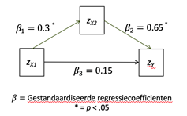

```{r, echo = FALSE, results = "hide"}
include_supplement("vufgb-mediation-001-nl.png", recursive = TRUE)
```

Question
========
De volgende resultaten worden verkregen in een mediatie-analyse. 



Er is sprake van ... mediatie. Op basis van het model is de verwachte correlatie tussen *X1* en *Y* ... .

Answerlist
----------
* Partiële; 0.95. 
* Partiële; 0.20.
* Volledige; 0.95.
* Volledige; 0.20.

Meta-information
================
exname: vufgb-mediation-001-nl
extype: schoice
exsolution: 0001
exsection: Inferential Statistics/Regression/Multiple linear regression/Mediation
exextra[Type]: Calculation, Interpreting graph
exextra[Language]: Dutch
exextra[Level]: Statistical Thinking