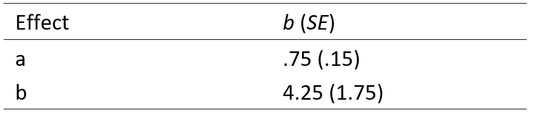

```{r, echo = FALSE, results = "hide"}
include_supplement("vufgb-mediation-006-nl.png", recursive = TRUE)
```

Question
========
The table below shows some of the outcomes of a mediation model. 



Calculate the standard error (*SE~ab~*) associated with the Sobel test for the mediation effect.

Answerlist
----------
* 0.95.
* 1.40.
* 1.46.
* 1.76.

Meta-information
================
exname: vufgb-mediation-006-EN
extype: schoice
exsolution: 0010
exsection:Inferential Statistics/Regression/Multiple linear regression/Mediation
exextra[Type]: Calculation, Interpreting output
exextra[Language]: Dutch
exextra[Level]: Statistical Thinking
