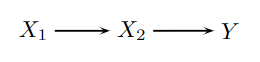

```{r, echo = FALSE, results = "hide"}
include_supplement("vufgb-mediation-007-nl-figure01.jpg", recursive = TRUE)
```

Question
========
  
Nolen-Hoeksema and Jackson (2009) examined whether sex differences in brooding were mediated by differences in control over negative thoughts. What are the variables mentioned in the mediation picture below?


  
Answerlist
----------
* $X_{1}$ =Sex, $X_{2}$ =Pickling, $Y$ =Control.
* $X_{1}$ =Picking, $X_{2}$ =Sex, $Y$ =Control.
* $X_{1}$ =Control, $X_{2}$ =Pickling, $Y$ =Sex.
* $X_{1}$ =Sex, $X_{2}$ =Control, $Y$ =Peeking.

Solution
========

Answerlist
----------
* Incorrect
* Incorrect
* Incorrect
* Correct

Meta-information
================
exname: vufgb-mediation-007-en
extype: schoice
exsolution: 0001
exsection: Inferential Statistics/Regression/Multiple linear regression/Mediation
exextra[Type]: Conceptual
exextra[Program]: 
exextra[Language]: English
exextra[Level]: Statistical Literacy
