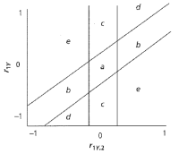

```{r, echo = FALSE, results = "hide"}
include_supplement("vufgb-mediation-015-nl-figure01.jpg", recursive = TRUE)
```

Question
========

The figure below shows the zero-order correlation between *y* and $x_{1}$ on the *y* axis and the partial correlation between *y* and $x_{1}$ monitored for $x_{2}$ on the *x* axis. What type of multivariate relationship exists when the pattern of correlations is in the planes (*c*)?


  
Answerlist
----------
* $X_{2}$ is irrelevant
* Suppressor effect
* Partial confounding or mediation
* Full confounding or mediation

Solution
========

Answerlist
----------
* Incorrect
* Incorrect
* Incorrect
* Correct

Meta-information
================
exname: vufgb-mediation-015-en
extype: schoice
exsolution: 0001
exsection: Inferential Statistics/Regression/Multiple linear regression/Mediation
exextra[Type]: Interpreting graph
exextra[Program]: 
exextra[Language]: English
exextra[Level]: Statistical Literacy
