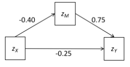

```{r, echo = FALSE, results = "hide"}
include_supplement("vufgb-mediation-019-nl-figure01.jpg", recursive = TRUE)
```

Question
========

Given is the mediation model below with the estimated standardized regression coefficients.

Use the 'tracing rules' to calculate the correlation between *M* and *Y*.


  
Answerlist
----------
* 0.55
* 0.65
* 0.75
* 0.85

Solution
========

Answerlist
----------
* Incorrect
* Incorrect
* Incorrect
* Correct

Meta-information
================
exname: vufgb-mediation-019-en
extype: schoice
exsolution: 0001
exsection: Inferential Statistics/Regression/Multiple linear regression/Mediation
exextra[ID]: 7a387
exextra[Type]: Calculation, Interpreting graph
exextra[Program]: 
exextra[Language]: English
exextra[Level]: Statistical Literacy
