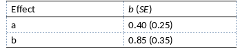

```{r, echo = FALSE, results = "hide"}
include_supplement("vufgb-mediation-024-nl-table01.jpg", recursive = TRUE)
```

Question
========

The table below shows some of the results of a mediation model. Calculate the standard error ($SE_{ab}$) that accompanies the Sobel test for mediation.


  
Answerlist
----------
* 0.25
* 0.30
* 0.31
* 0.40

Solution
========

Answerlist
----------
* Incorrect
* Incorrect
* Correct
* Incorrect

Meta-information
================
exname: vufgb-mediation-024-en
extype: schoice
exsolution: 0010
exsection: Inferential Statistics/Regression/Multiple linear regression/Mediation
exextra[ID]: faf05
exextra[Type]: Calculation, Interpreting output
exextra[Program]: 
exextra[Language]: English
exextra[Level]: Statistical Thinking
