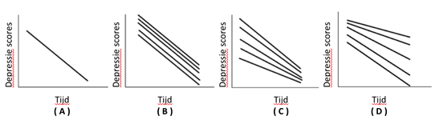

```{r, echo = FALSE, results = "hide"}
include_supplement("vufgb-mixeddesignanova-001-nl", recursive = TRUE)
```

Question
========
Research shows a negative relationship between time and depression. The sample includes adolescents with depression who are all receiving therapy. A *linear mixed model* with *random intercept* and *random slope* shows the following: adolescents who were more depressed at the start of therapy benefit less from therapy. Which figure represents these findings? 



Answerlist
----------
* Figure A.
* Figure B.
* Figure C.
* FIgure D.

Meta-information
================
exname: vufgb-mixeddesignanova-001-EN
extype: schoice
exsolution: 0001
exsection:Inferential Statistics/Parametric Techniques/ANOVA/Mixed design ANOVA
exextra[Type]: Case, Interpreting graph
exextra[Language]: Dutch
exextra[Level]: Statistical Thinking
