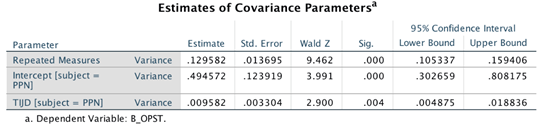

```{r, echo = FALSE, results = "hide"}
include_supplement("vufgb-mixeddesignanova-003-nl", recursive = TRUE)
```

Question
========
The following results are found in *linear mixed model* for repeated measures. The variable "Degree of openness" was measured during an intervention for parents with intellectual disabilities.



What is the correct interpretation of the variance estimate "Intercept [subject = PPN]"?

Answerlist
----------
* Parents became more open during the intervention.
* The extent to which parents were already opening up at the start of the intervention varies.
* The degree to which parents started to open up more during the intervention varies.
* The extent to which parents open up during the intervention depends on the time of day.

Meta-information
================
exname: vufgb-mixeddesignanova-003-EN
extype: schoice
exsolution: 0100
exsection:Inferential Statistics/Parametric Techniques/ANOVA/Mixed design ANOVA
exextra[ID]: aad8d
exextra[Type]: Interpreting output
exextra[Language]: Dutch
exextra[Level]: Statistical Thinking
