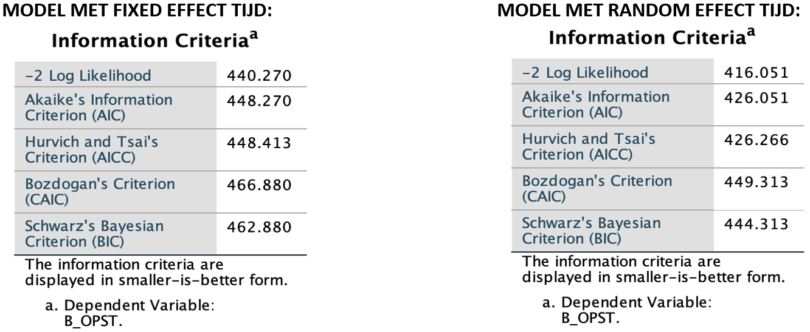

```{r, echo = FALSE, results = "hide"}
include_supplement("vufgb-mixeddesignanova-005-nl", recursive = TRUE)
```

Question
========
Two linear mixed models are used:

* A model with fixed linear effect of time (4 parameters);
* And a model with random linear effect of time (5 parameters). 



Perform a *likelihood-ratio test* to test whether there is a random effect of Time.

Answerlist
----------
* $χ^2 (df = 1) = 22.22$; $p < .001$.
* $χ^2 (df = 5) = $22.22; $p < .001$.
* $χ^2 (df = 1) = $24.22; $p < .001$.
* $χ^2 (df = 5) = $24.22; $p < .001$.

Meta-information
================
exname: vufgb-mixeddesignanova-005-en
extype: schoice
exsolution: 0010
exsection:Inferential Statistics/Parametric Techniques/ANOVA/Mixed design ANOVA
exextra[Type]: Calculation, Case, Interpreting output
exextra[Language]: Dutch
exextra[Level]: Statistical Thinking
