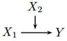

```{r, echo = FALSE, results = "hide"}
include_supplement("vufgb-moderation-001-nl.png", recursive = TRUE)
```

Question
========
Gegeven is onderstaande multivariate relatie. Wat voor type variabele is $X_{2}$? 



Answerlist
----------
* Een moderator.
* Een mediator.
* Een “lurking” variabele.
* Een “confounder” variabele.

Meta-information
================
exname: vufgb-moderation-001-nl
extype: schoice
exsolution: 1000
exsection: Inferential Statistics/Regression/Multiple linear regression/Moderation
exextra[ID]: fbc91
exextra[Type]: Conceptual
exextra[Language]: Dutch
exextra[Level]: Statistical Literacy
