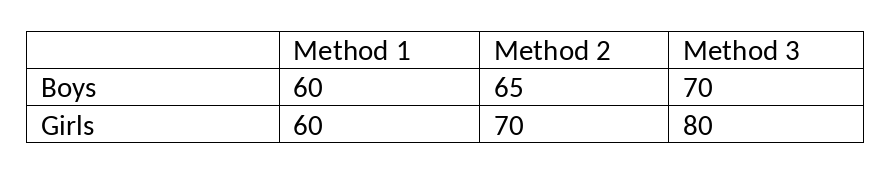

```{r, echo = FALSE, results = "hide"}
include_supplement("vufgb-moderation-003-en-graph-01.png", recursive = TRUE)
```
Question
========
  
From a twoway ANOVA the interaction between gender and three educational methods on reading ability appears to be significant. The following means are found. Which description of the interaction-effect is correct? The differences in reading ability…

 
  
Answerlist
----------
* … between boys and girls depend on the education method.
* … between the educational methods are larger in boys than in girls.
* … between educational methods disappear when controlling for gender.
* … between boys and girls become stronger when they follow the same educational method.

Solution
========

Answerlist
----------
* Correct
* Incorrect
* Incorrect
* Incorrect

Meta-information
================
exname: vufgb-moderation-003-en
extype: schoice
exsolution: 1000
exsection: Inferential Statistics/Regression/Multiple linear regression/Moderation, Inferential Statistics/Parametric Techniques/ANOVA/Twoway ANOVA
exextra[Type]: Conceptual
exextra[Language]: English
exextra[Level]: Statistical Reasoning
